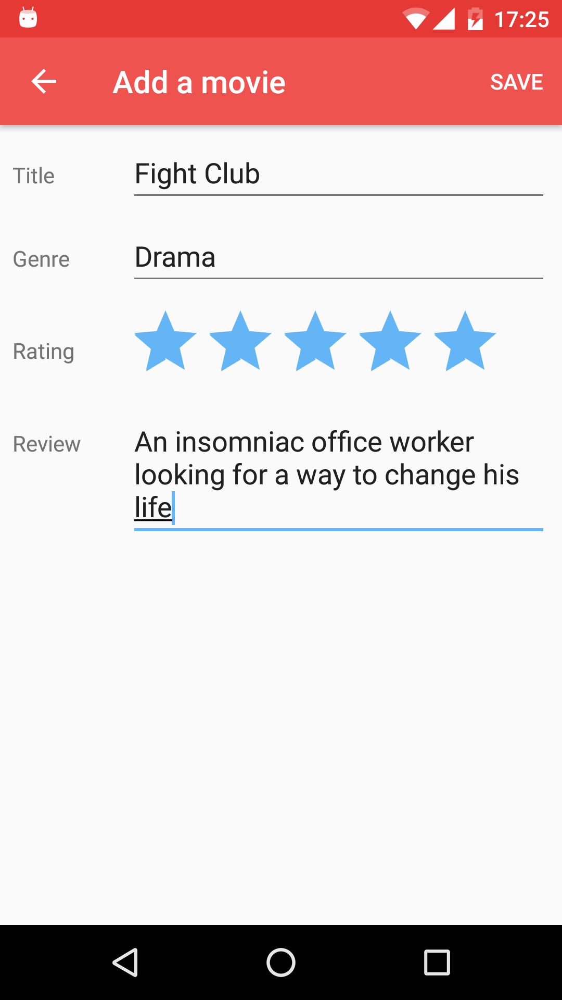

# WatchedMovies
I made this app based on Udacity's "Android Basics: Data Storage" course, using SQLite, ContentProvider, CursorAdapter, CursorLoader, ListView, AlertDialogs, OptionsMenu etc.

Screenshots:
   
